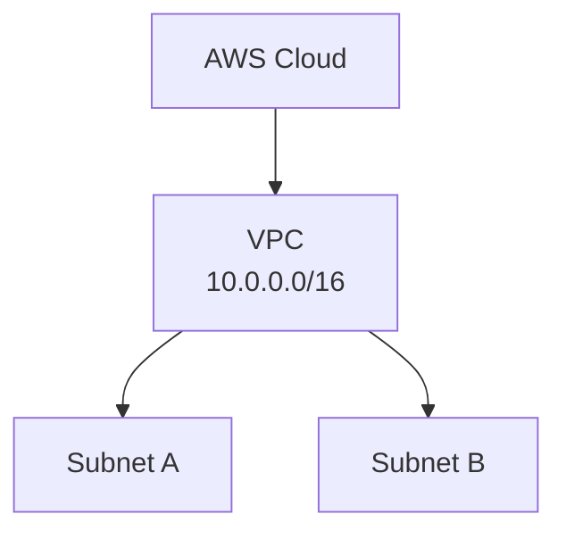
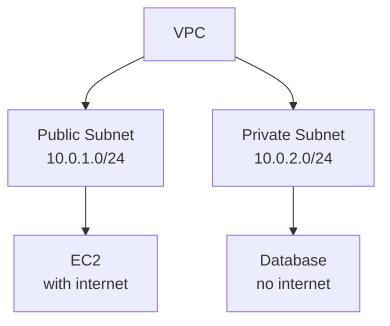
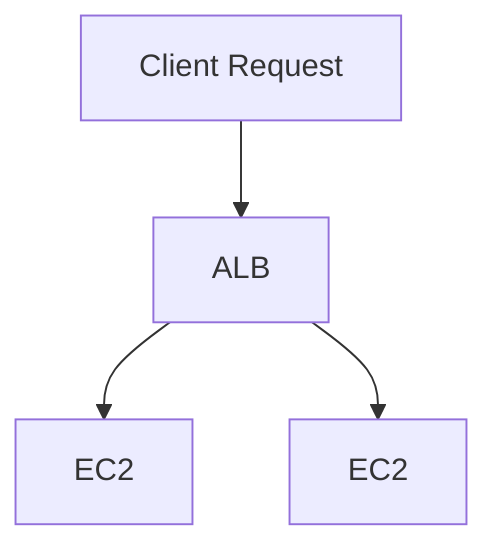
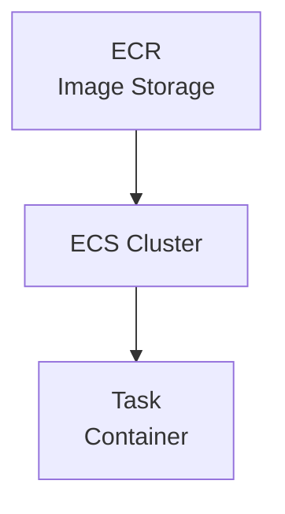
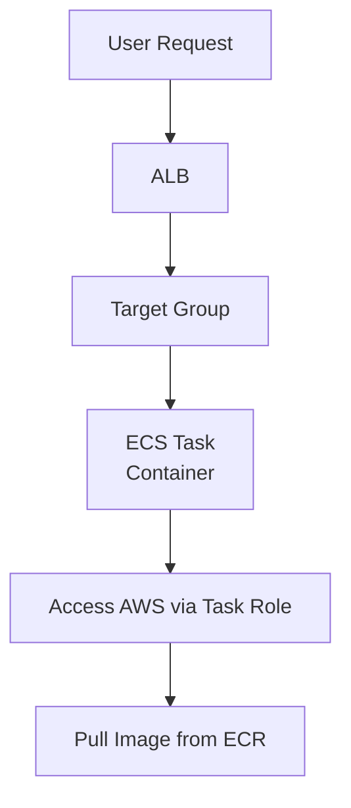
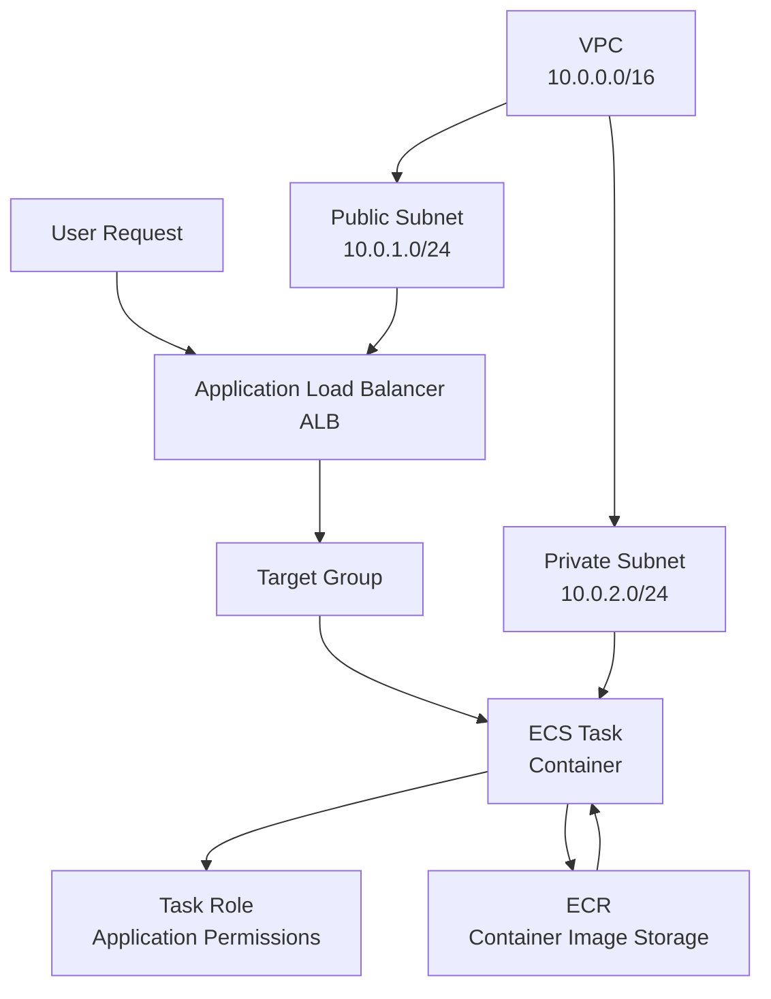

# AWS Core Concepts Notes

**Sheryians Coding School Cohort**

---

# 1. Virtual Private Cloud (VPC)

## Definition

A VPC is a logically isolated network in AWS where you can launch resources like EC2, databases, and services.

## Key Points

- You define IP address range (CIDR block).
- Full control over networking (IP, routing, security).
- Acts like a private data center inside AWS.

## Diagram

---

# 2. Subnets

## Definition

A subnet is a smaller network inside a VPC.

## Types

- **Public Subnet:** Has internet access via Internet Gateway.
- **Private Subnet:** No direct internet access.

## Key Points

- Each subnet belongs to one Availability Zone.
- Used to organize and secure resources.

## Diagram

---

# 3. Security Group (SG)

## Definition

A Security Group is a virtual firewall attached to AWS resources.

## Key Points

- Controls inbound and outbound traffic.
- Works at instance level.
- Stateful: Return traffic is automatically allowed.

## Example

- **Allow port 80 →** HTTP traffic allowed
- **Block all others →** denied

---

# 4. Target Group (TG)

## Definition

A Target Group is used to route requests to registered targets like EC2 instances, containers, or IP addresses.

## Key Points

- Used by Load Balancers.
- Performs health checks on targets.
- Routes traffic only to healthy targets.

---

# 5. Application Load Balancer (ALB)

## Definition

ALB distributes incoming HTTP/HTTPS traffic across multiple targets.

## Key Points

- Works at Layer 7 (Application Layer).
- Supports path-based and host-based routing.
- Improves availability and scalability.

## Diagram

---

# 6. IAM Users and Roles

## IAM User

### Definition

An IAM user is an individual identity with permissions to access AWS.

### Key Points

- Has username and credentials.
- Used by humans.

---

## IAM Role

### Definition

An IAM role is an identity that can be assumed by services or users.

### Key Points

- No permanent credentials.
- Temporary access.
- Used by AWS services (EC2, ECS, Lambda).

---

# 7. Task Role (ECS)

## Definition

A Task Role provides permissions to containers running inside an ECS task.

## Key Points

- Used by application inside container.
- Example: Access S3 from container.

---

# 8. Task Execution Role (ECS)

## Definition

A Task Execution Role is used by ECS to perform operations like pulling images or sending logs.

## Key Points

- Used by ECS agent, not your app.

## Example

- Pull image from ECR
- Push logs to CloudWatch

---

# 9. Elastic Container Registry (ECR)

## Definition

ECR is a managed Docker container registry.

## Key Points

- Stores container images.
- Integrated with ECS.
- Secure and scalable.

---

# 10. Elastic Container Service (ECS)

## Definition

ECS is a container orchestration service to run and manage Docker containers.

## Key Points

- Runs containers on EC2 or Fargate.
- Handles scaling, deployment, and management.
- Works with ECR for images.

## Diagram

---

# 11. Why Not Use Root User Credentials

## Definition

The root user is the account owner with full access to all AWS services.

## Reasons to Avoid

- **Full access:** No restrictions.
- **High security risk if compromised.**
- **Cannot limit permissions.**

## Best Practice

- Use root user only for account setup.
- Create IAM users with limited permissions.
- Enable MFA for root account.

---

# Summary Flow

---

# AWS Architecture Overview

